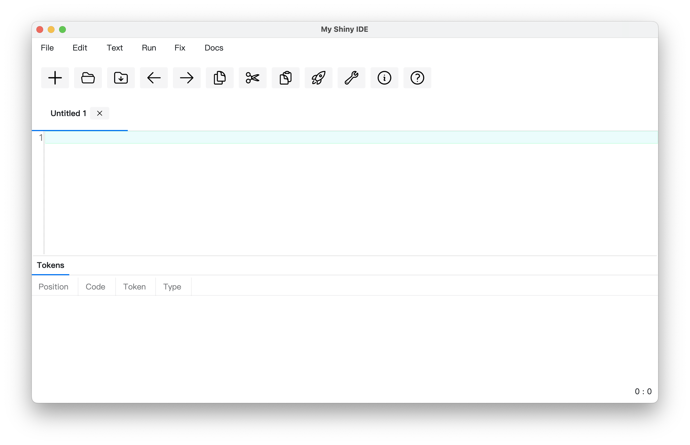
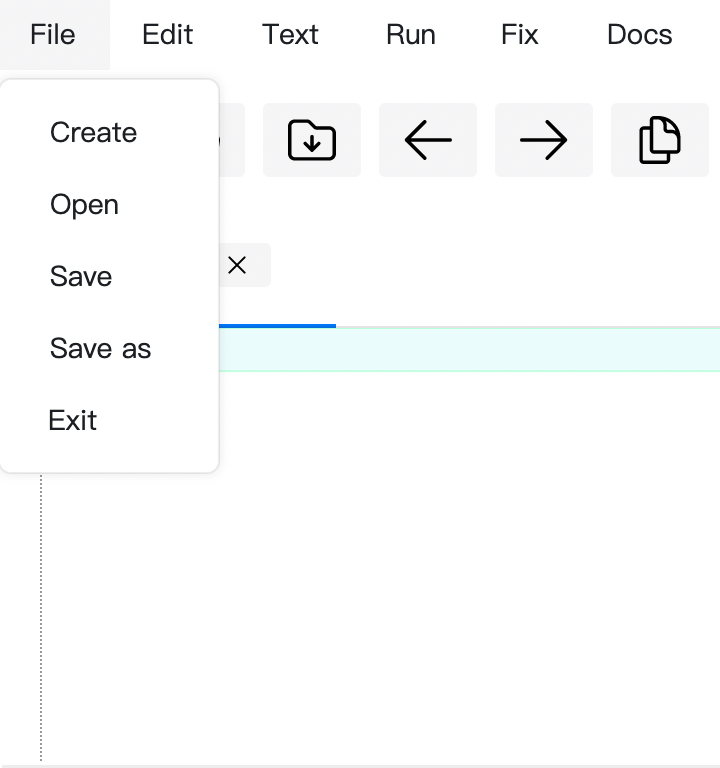
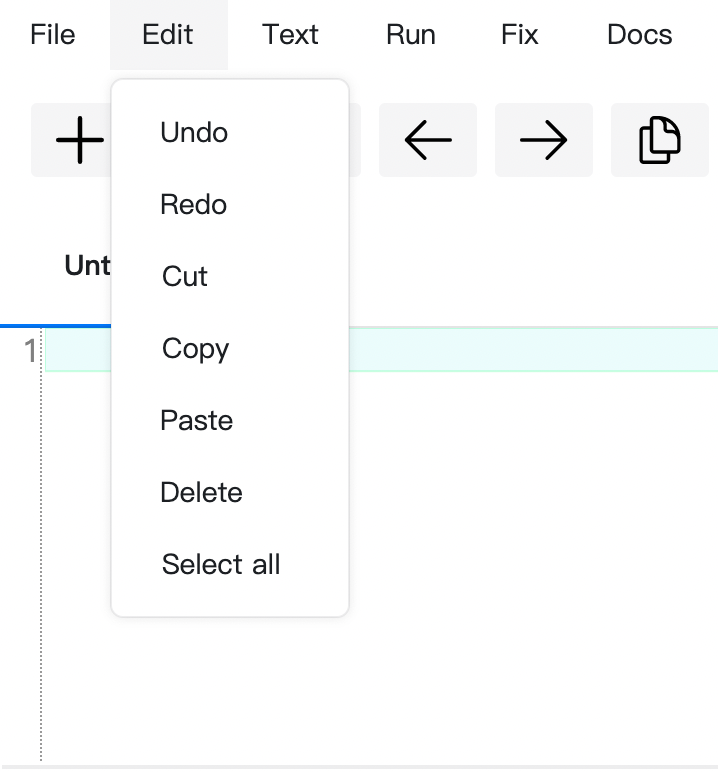
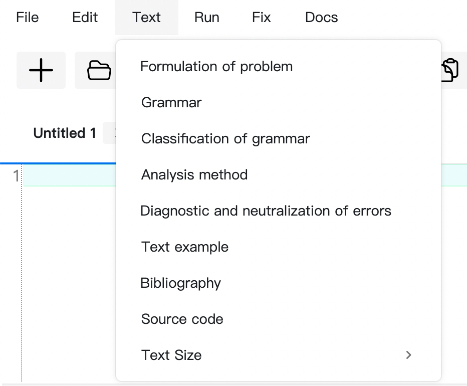
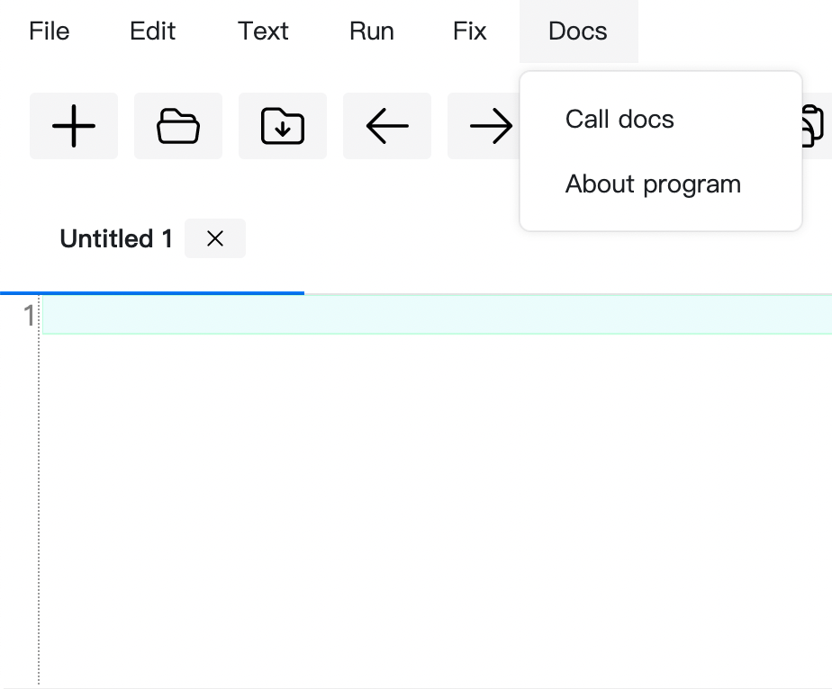
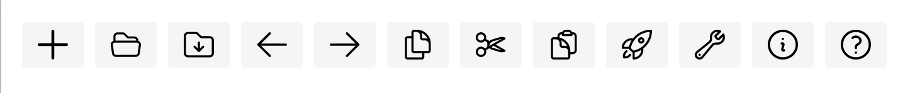
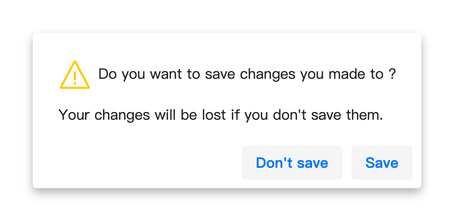
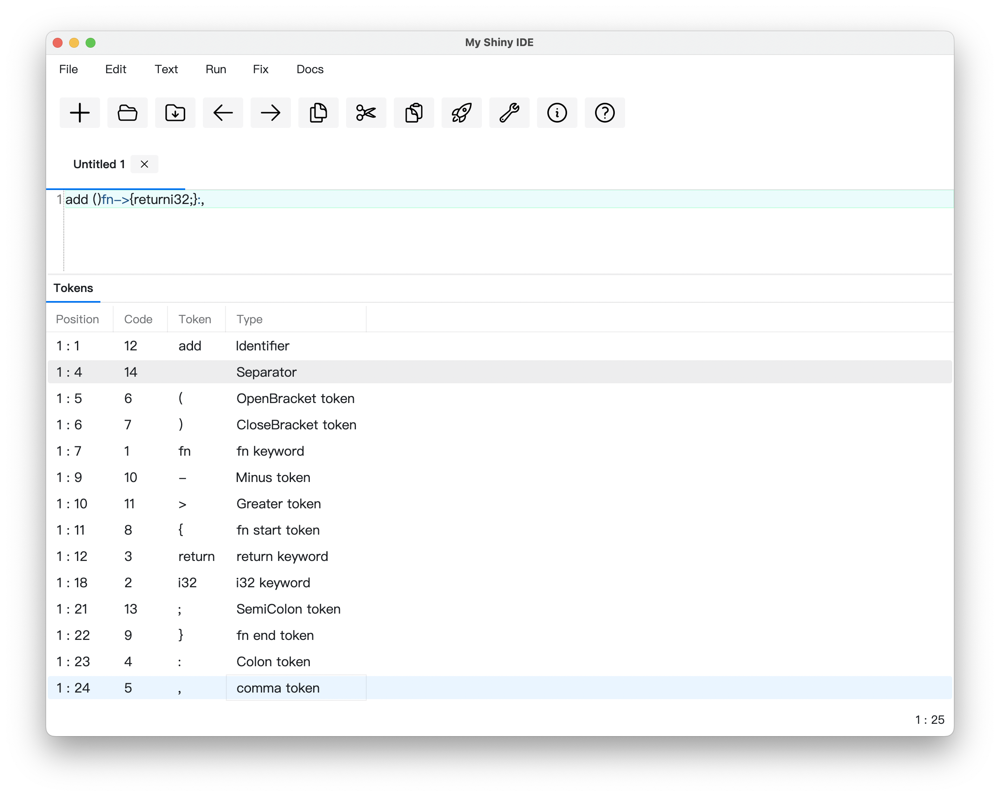
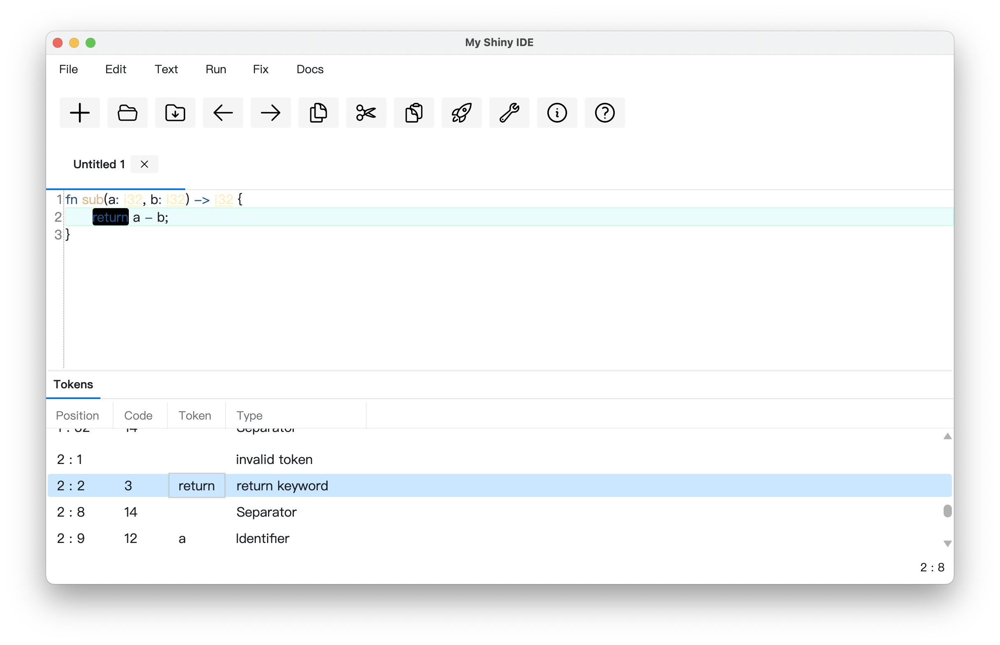

# Компилятор

Разработка текстового редактора с функциями языкового процессора.

## Оглавление

- [Лабораторная работа №1: Разработка пользовательского интерфейса (GUI) для языкового процессора](#лабораторная-работа-1-разработка-пользовательского-интерфейса-gui-для-языкового-процессора)
- [Лабораторная работа №2: Разработка лексического анализатора (сканера)](#лабораторная-работа-2-разработка-лексического-анализатора-сканера)

## Лабораторная работа №1: Разработка пользовательского интерфейса (GUI) для языкового процессора
**Тема:** разработка текстового редактора с возможностью дальнейшего расширения функционала до языкового процессора.

**Цель работы:** разработать приложение с графическим интерфейсом пользователя, способное редактировать текстовые данные. Это приложение будет базой для будущего расширения функционала в виде языкового процессора.

**Язык реализации:** C#, Avalonia.

### Интерфейс текстового редактора



#### Получившийся текстовый редактор имеет следующие элементы:
1. Заголовок окна.

   Содержит информацию о названии открытого файла, полного пути к нему, а также о том, сохранен ли он на текущий момент (наличие символа звездочки справа от названия означает наличие несохраненных изменений).
3. Меню
   | Пункт меню | Подпункты |
   | ------ | ------ |
   | Файл |  |
   | Правка |  |
   | Текст |  |
   | Справка |  |
4. Панель инструментов
   
   

   - Создать
   - Открыть
   - Сохранить
   - Изменить размер текста
   - Отменить
   - Повторить
   - Копировать
   - Вырезать
   - Вставить
   - Пуск
   - Вызов справки
   - О программе
5. Область редактирования
   
   Поддерживаются следующие функции:
   - Изменение размера текста
   - Открытие файла при перетаскивании его в окно программы
   - Базовая подсветка синтаксиса
   - Нумерация строк
7. Область отображения результатов

   В область отображения результатов выводятся сообщения и результаты работы языкового процессора.

   Поддерживаются следующие функции:
   - Изменение размера текста
   - Отображение ошибок в виде таблицы
8. Строка состояния

   В дополнении к информации, выводимой в заголовке окна, показываются текушие номера строки и столбца, где находится курсор.

### Вывод сообщений

| Сообщение | Описание | Изображение |
| ------ | ------| ------ |
| Закрытие окна программы | Появляется при закрытии программы нажатием крестика или комбинацией клавиш при наличии несохраненных изменений |  |

## Лабораторная работа №2: Разработка лексического анализатора (сканера)

**Тема:** разработка лексического анализатора (сканера).

**Цель работы:** изучить назначение лексического анализатора. Спроектировать алгоритм и выполнить программную реализацию сканера.

| № | Тема | Пример верной строки | Справка |
| ------ | ------ | ------ | ------ |
| 47 |  Создание функции языка Rust | fn sub(a: i32, b: i32) -> i32 { return a - b; } | [ссылка](https://google.com) |

1. Спроектировать диаграмму состояний сканера.
2. Разработать лексический анализатор, позволяющий выделить в тексте лексемы, иные символы считать недопустимыми (выводить ошибку).
3. Встроить сканер в ранее разработанный интерфейс текстового редактора. Учесть, что текст для разбора может состоять из множества строк.

**Входные данные:** строка (текст программного кода).

**Выходные данные:** последовательность условных кодов, описывающих структуру разбираемого текста с указанием места положения и типа.

### Примеры допустимых строк

```rust
fn sub(a: i32) -> i32 { 
	return a;
}```
```rust
fn add(a: i32, b: i32) -> i32 {
    return a + b;
}
```
```rust
fn add(a: i32, b: i32, z: i32) {
    return a + b;
}
```
### Диаграмма состояний сканера


### Тестовые примеры

1. **Тест №1.** Пример, показывающий все возможные лексемы, которые могут быть найдены лексическим анализатором.
   
   
2. **Тест №2.** Сложный пример.

   > При нажатии на лексему в таблице, соответствующий фрагмент текста подсвечивается в поле редактирования.
  
   
